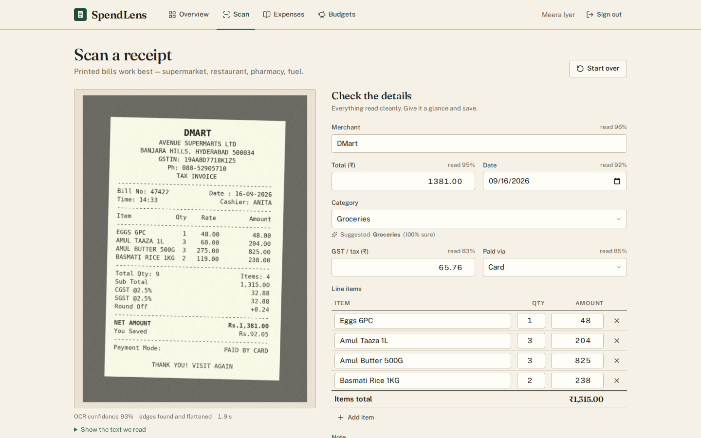
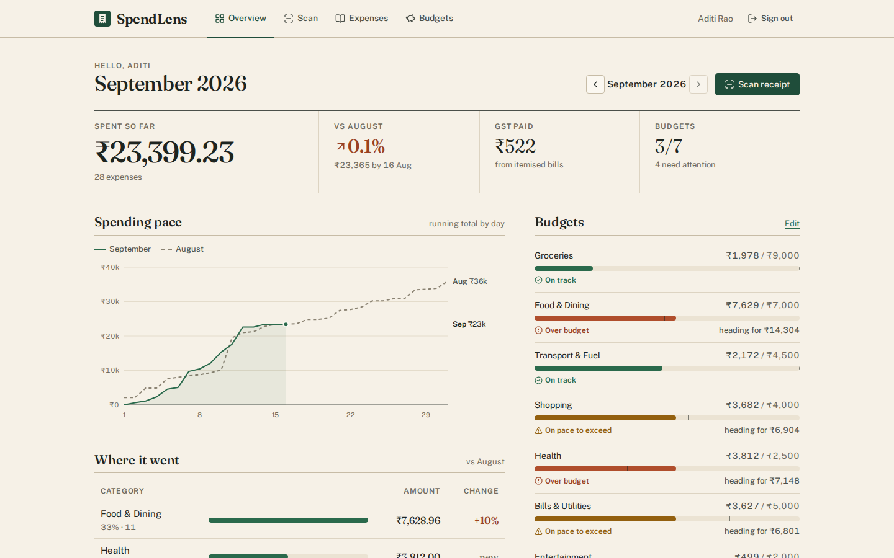
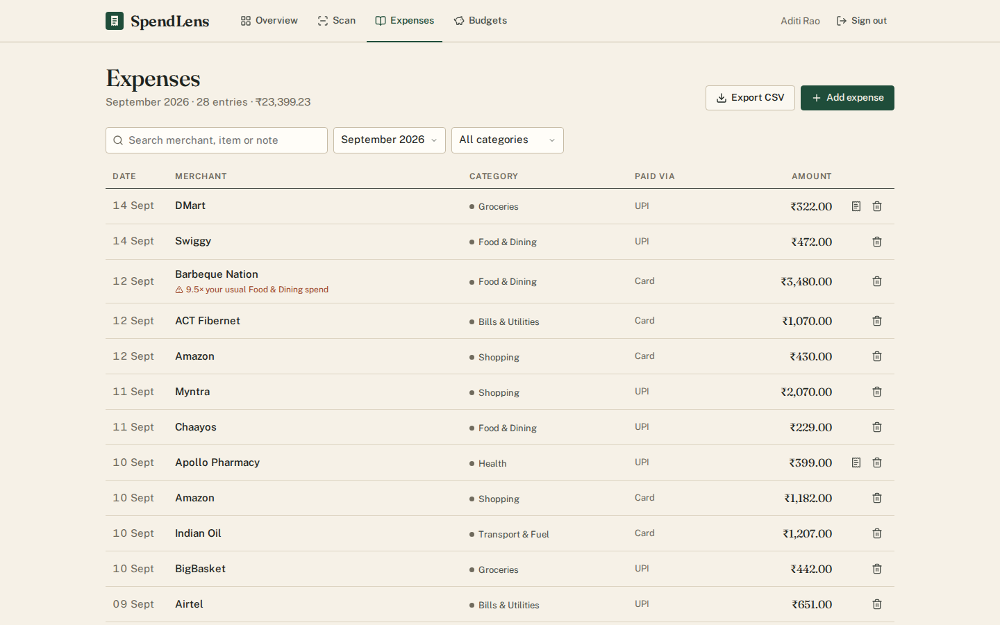
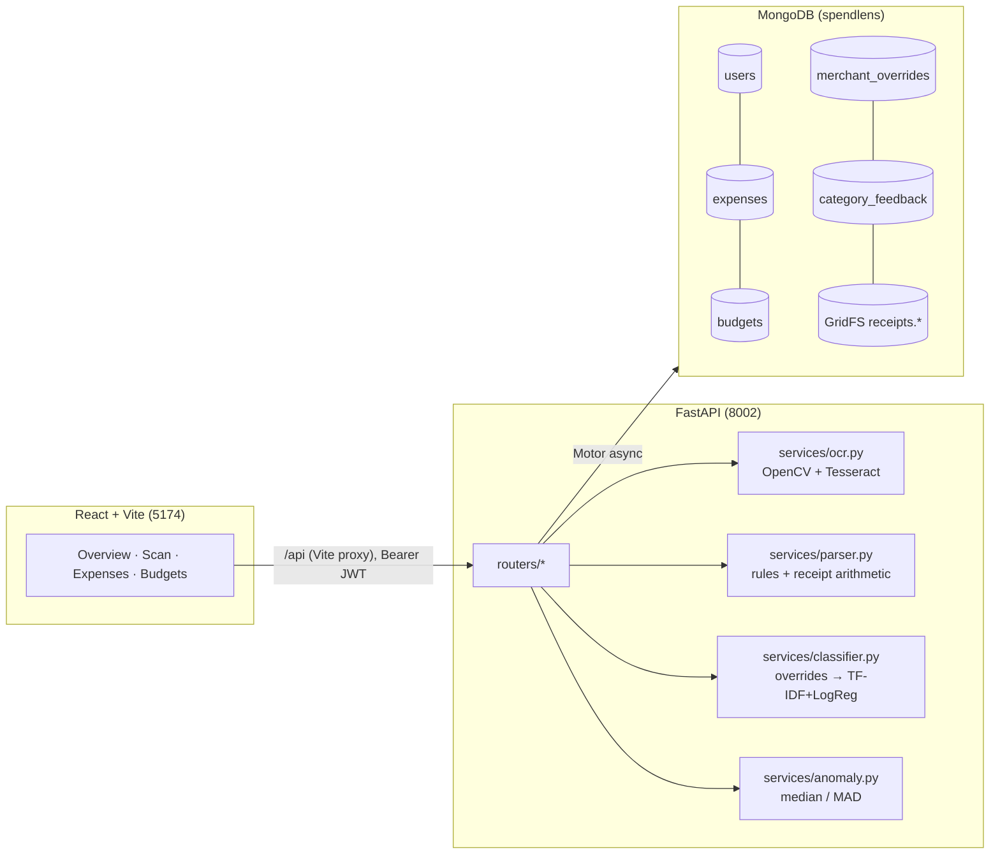

# SpendLens

Photograph a paper bill, check the numbers it read, and see where the month went. SpendLens is an
expense tracker built for India: ₹ with Indian digit grouping, GST lines, Indian date formats, and
merchants like DMart, Reliance Fresh, Apollo Pharmacy, Swiggy and fuel pumps.



| Overview | Expenses |
|---|---|
|  |  |

## What it does

1. **Scan a receipt.** Drag and drop, pick a file, or use the phone camera (`<input capture>`).
   - OpenCV cleans up the photo, Tesseract reads the text, and a rule-based parser pulls out the
     merchant, date, total, GST, payment mode and line items. Each field comes with a confidence score.
   - The review screen shows the photo next to an editable form. Fields read with low confidence are
     marked in orange.
   - The photo is shrunk to 1 MB or less and stored in MongoDB GridFS.
2. **Automatic categories (ML).** A TF-IDF + Logistic Regression model suggests one of 10 categories
   from the merchant name and item text.
   - **It learns from your corrections.** When you change a category, SpendLens remembers that
     merchant for you (the override is checked before the model). The correction is also logged so
     `retrain` can add it to the model.
3. **Expenses ledger.** Add, edit, delete, search (merchant, item or note), filter by month or
   category, and page through results. Scanned expenses keep a link to their receipt image.
4. **Budgets.** Set a monthly limit per category and see a progress bar for each. A category gets an
   "On pace to exceed" warning when the month-end projection (a straight-line extrapolation of your
   spending so far) is over its budget.
5. **Overview.**
   - Month total compared with the same days of last month
   - Running-total pace chart (this month vs last)
   - Category split with change from last month
   - Top merchants and budget status
   - **Anomalies:** expenses that are unusual for *your* spending in that category, shown with a
     reason such as "9.5× your usual Food & Dining spend"
6. **CSV export** of a month, with a UTF-8 BOM so Excel on Windows shows ₹ and accents correctly.

## Architecture



```
photo ─► decode (EXIF-aware) ─► resize ─► find paper (largest 4-point contour) ─► perspective warp
      ─► grayscale ─► non-local-means denoise ─► deskew (text-line blobs + minAreaRect, Hough fallback)
      ─► adaptive threshold ──┐
      ─► denoised grayscale ──┴► Tesseract ×2 in parallel ─► keep the read with higher mean confidence
      ─► lines + word confidences ─► parser ─► fields{value, confidence} + items
      ─► receipt arithmetic check (subtotal + GST + round-off = total?) ─► category suggestion
```

```
backend/
  app/
    main.py            lifespan (indexes, model load, Tesseract probe), error handlers
    config.py db.py security.py auth.py schemas.py utils.py categories.py
    routers/           receipts, expenses, budgets, insights, categories
    services/          ocr, parser, classifier, anomaly, images
  ml/
    dataset.py         synthetic merchant/item dataset (train/test split by merchant)
    pipeline.py        TF-IDF (word + char) feature union + classifiers
    train_classifier.py  → ml/artifacts/category_model.joblib + metrics.json
    retrain.py         adds user corrections to the model
    receipts_synth.py  generates photo-like thermal receipts with ground truth
    eval_ocr.py        end-to-end parse accuracy → metrics.json
    fonts/             DejaVu Sans Mono (bundled so receipts render the same on every OS)
    metrics.json
  scripts/seed.py      demo user with about 75 days of data
  tests/               pytest: API (real Mongo), parser, OCR pipeline, ML
frontend/src/          pages/, components/ (hand-rolled SVG chart), lib/ (api, auth, format)
e2e/                   Playwright journey + run_e2e.sh
samples/               3 generated receipts to try (with .json ground truth)
```

## ML approach and measured results

All numbers below were computed by the scripts and are stored in `backend/ml/metrics.json`.

### 1. Receipt reading (OpenCV + Tesseract + parser)

**Parser rules:**
- **Total:** looks for lines with total-like keywords, ranked: *Grand Total* > *Net Amount/Payable* >
  *Bill Amount* > *Total Amount* > *Total* > *Amount*. It skips *Sub Total*, *Total Qty*, tax lines,
  *You Saved* and *Round Off*, and uses the last amount on the chosen line. If no such line is found,
  it falls back to the largest amount with paise (confidence 0.35).
- **Receipt arithmetic:** the parser checks `subtotal + CGST + SGST + round-off = total`, or
  `rate × litres ≈ amount` on fuel slips.
  - If the numbers don't match, it tries swapping digits that Tesseract often confuses (a thermal
    `0` read as `6` or `8`) and keeps the version that adds up. That field stays flagged for review.
  - If nothing matches, the total's confidence is capped at 0.6, so the UI marks it orange.
- **Dates:** day-first Indian formats (`16/09/2026`, `16-09-26`, `16.09.26`, `16-Sep-2026`,
  `16 Sept 2026`, `2026-09-16`, `Sep 16, 2026`). Lines labelled *Date/Dt* rank higher. Impossible
  or future dates are rejected.
- **Merchant:** fuzzy match (difflib) of the header lines against about 330 known Indian merchants.
  If there's no match, the first header line that looks like a name is used (e.g. "Sri Krishna
  Sweets"), with lower confidence.

**Evaluation:** `python -m ml.eval_ocr --n 30`, on 30 generated receipts from 12 shops, rotated ±4°,
blurred, noisy and photographed on a background. Exact-match rate:

| field | with preprocessing | raw Tesseract (ablation) |
|---|---|---|
| merchant | **1.00** | 1.00 |
| date | **1.00** | 1.00 |
| total | **1.00** | 0.967 |
| GST | **0.967** | 0.90 |
| payment mode | 1.00 | 1.00 |
| line-item count | **0.933** | 0.80 |
| time / receipt (2 shared CPUs) | 2.4 s | 2.7 s |

These are synthetic receipts, so they're easier than real crumpled bills. During development this
evaluation caught a real bug: a median blur after thresholding filled in the slashed zeros, so
Tesseract read `0` as `6`.

### 2. Category classifier

- **Model:** `FeatureUnion(word 1–2-gram TF-IDF, char_wb 2–4-gram TF-IDF) → LogisticRegression(C=8, balanced)`.
  - Word n-grams catch "petrol" and "movie ticket".
  - Character n-grams cope with OCR typos ("pharrnacy") and unseen names ("…Medicals").
- **Data:** `ml/dataset.py` generates samples (8.6k for the train/test evaluation, 9.8k for the final model): merchant only, items only, or merchant +
  items, with about 35% of samples given OCR-style noise.
- **Split:** by merchant. 25% of merchants in each category appear only in the test set, so the
  score measures how well the model handles shops it has never seen.

| model (held-out merchants) | accuracy | macro-F1 | unseen merchant name only |
|---|---|---|---|
| **TF-IDF + LogisticRegression** (selected) | **0.870** | **0.873** | 0.498 |
| TF-IDF + ComplementNB | 0.870 | 0.870 | 0.479 |

A bare, unseen merchant name gets only about 50% accuracy, because a name like "Torrent Power"
doesn't say much without items. That's why per-user overrides and the correction loop matter.
Per-class F1 is in `metrics.json`; Shopping (0.81) and Food & Dining (0.83) are the weakest.

**Learning from corrections:**
1. The client sends `suggested_category` along with the category the user chose.
2. If they differ, the server upserts `merchant_overrides {user_id, merchant_key, category}` and
   logs a row in `category_feedback`.
3. `suggest()` checks the override first (source "your correction", confidence 1.0).
4. `POST /api/categories/retrain` (or `python -m ml.retrain`) refits the model on the synthetic set
   plus every correction (each repeated 5×), saves it atomically and hot-reloads it.

### 3. Anomaly detection

For each category, a Mongo aggregation collects the user's amounts from the last 180 days (at least
6 are needed). The modified z-score is `z = 0.6745·(x − median)/MAD` (Iglewicz–Hoaglin). An
expense is flagged when **z > 3.5 and it's at least 2× the category median**. The second condition
stops categories with very low MAD from flagging tiny variations. When MAD is 0, it falls back to
10% of the median.

Why median/MAD rather than mean/std: one ₹9,000 purchase inflates the standard deviation and hides
itself, but it barely moves the median. IsolationForest was considered but not used. It needs more
history per user than a new account has, and it can't give a plain reason like "3.4× your usual".

## API

All routes except auth and health need `Authorization: Bearer <jwt>`. Errors always look like
`{"detail": str | [{loc, msg}], "status": int}`.

| Method | Path | Purpose |
|---|---|---|
| POST | `/api/auth/register` · `/api/auth/login` | Returns `{token, user}` |
| GET | `/api/auth/me` | Current user |
| GET | `/api/health` | DB, `ocr: {available, version, cmd}`, classifier loaded |
| POST | `/api/receipts/scan` | multipart `file` (JPG/PNG/WebP, ≤ 8 MB) → `receipt_id`, `fields{value, confidence}`, `items`, `category` suggestion, OCR diagnostics. 415 wrong type, 413 too big, 422 unreadable |
| GET | `/api/receipts/{id}/image` | Stored JPEG (owner only) |
| GET | `/api/expenses?month=YYYY-MM&category=&q=&page=&limit=` | Page + `total` + `sum` (one `$facet`), each row annotated with `anomaly` |
| POST | `/api/expenses` | Create. Category is predicted if omitted. `suggested_category` ≠ `category` records a correction |
| GET / PATCH / DELETE | `/api/expenses/{id}` | Read / partial update (category change is learned) / delete (also deletes the image) |
| GET | `/api/expenses/export?month=` | Streamed CSV download |
| GET | `/api/budgets?month=` | Spent, linear projection, `ok · at_risk · over` per budget |
| PUT | `/api/budgets` | Upsert `{category, amount}` |
| DELETE | `/api/budgets/{category}` | Remove a budget |
| GET | `/api/insights/overview?month=` | Totals, same-period comparison, category split, daily cumulative series (this and last month), top merchants, anomalies, budgets |
| GET | `/api/categories` | Category and payment-mode lists |
| POST | `/api/categories/suggest` | `{merchant, items}` → suggestion (used while typing) |
| GET | `/api/categories/overrides` | Your learned merchant → category map |
| POST | `/api/categories/retrain` | Refit the model with all corrections |

**Indexes** (created in `ensure_indexes`):
- `expenses (user_id, date)`, `(user_id, category, date)`, `(user_id, merchant_key)`
- unique `budgets (user_id, category)`
- unique `merchant_overrides (user_id, merchant_key)`
- `receipts.files (metadata.user_id)`

## Setup on Windows (step by step)

Prerequisites: **Python 3.11**, **Node 20+**, and **MongoDB Community 7 or 8** running on
`localhost:27017`. MongoDB 7+ is needed because it's what this project was tested on.

### 1. Install Tesseract OCR (not pip-installable)

1. Download the Windows installer from UB Mannheim: <https://github.com/UB-Mannheim/tesseract/wiki>
   (e.g. `tesseract-ocr-w64-setup-5.x.x.exe`).
2. Run it and keep the default path `C:\Program Files\Tesseract-OCR`. English is included by default.
3. Make it findable, in **either** of these ways:
   - **Add it to PATH:** Start → "Edit the system environment variables" → Environment Variables →
     *Path* → New → `C:\Program Files\Tesseract-OCR`. Then open a **new** terminal and check with
     `tesseract --version`.
   - **Or set it in `backend\.env`:** `TESSERACT_CMD=C:\Program Files\Tesseract-OCR\tesseract.exe`
4. Check it: `http://127.0.0.1:8002/api/health` should show `"ocr": {"available": true, ...}`.

If Tesseract is missing, the app still works. The Scan page explains that text reading is off, still
stores the photo, and lets you type the details in.

### 2. Backend

```powershell
cd spendlens\backend
python -m venv .venv
.venv\Scripts\activate
pip install -r requirements-dev.txt
copy .env.example .env          # then edit JWT_SECRET (and TESSERACT_CMD if needed)
python -m ml.train_classifier   # optional: a trained model is included (~10 s to rebuild)
python -m scripts.seed          # demo user: demo@spendlens.app / demo1234
uvicorn app.main:app --reload --port 8002
```

The saved model is tied to the scikit-learn version it was trained with. If yours differs, the API
retrains it once at startup (about 10 s) and saves it.

### 3. Frontend (second terminal)

```powershell
cd spendlens\frontend
npm install
npm run dev                     # http://localhost:5174  (proxies /api to 127.0.0.1:8002)
```

On the login screen, click **Use demo account**. To try scanning, upload one of the images in `samples\`.

## Tests

```powershell
cd backend
python -m pytest -q               # 52 tests: API against real Mongo (throwaway test_* database),
                                  # parser, deskew/contour, OCR accuracy on generated receipts, ML
python -m ml.eval_ocr --n 30      # parse accuracy → ml/metrics.json
```

End-to-end (Playwright, headless Chromium). It starts the backend and a production build of the
frontend, then runs this journey:

register → upload a generated receipt → check merchant, total, date and suggested category → correct
the category → save → add a manual expense (category suggested while typing) → filter and search →
view the receipt image → export CSV → set budgets → Overview totals, category split and budget
status → confirm the corrected merchant now defaults to the new category.

It also signs in as the demo user and takes the screenshots in `docs/screenshots/`.

```bash
# macOS/Linux or Git Bash on Windows
./e2e/run_e2e.sh
# Windows without bash: start backend (8002) and `npm run build && npx vite preview --port 5174`, then
set BASE_URL=http://127.0.0.1:5174
python -m pytest e2e/test_e2e.py -v
```

(Run `playwright install chromium` once on a new machine.)

## Viva notes

**Key decisions**
- **Rule-based parser + ML classifier**, not end-to-end ML. Receipt layouts follow strong
  conventions, rules are explainable and testable, and there's no labelled receipt dataset. ML is
  used where rules fail: mapping free-text merchants and items to categories.
- **Confidence on every field.** Instead of pretending OCR is perfect, the UI asks the user to check
  exactly the uncertain fields. Confidence combines Tesseract's word confidence, how strong the
  keyword match was, and whether the receipt arithmetic adds up.
- **Two OCR passes in parallel** (binary and grayscale), keeping the one with higher mean
  confidence. Adaptive threshold helps with shadows but can erase faint thermal print. The ablation
  in `metrics.json` shows preprocessing helps overall.
- **Split by merchant** when evaluating the classifier. A random split would put "DMart …" rows in
  both train and test and overstate accuracy.
- **Per-user overrides before the global model:** instant, per-person learning without retraining.
  Retraining is global and batched.
- **Aggregation pipelines** (`$facet`) for list page + count + sum and for the whole overview, so
  there's one round trip each. CPU work (OpenCV, Tesseract, sklearn) runs in `run_in_threadpool`.
  The model loads once in the lifespan.
- **Images in GridFS**, shrunk to 1 MB or less: one database to back up, ownership checked through
  `metadata.user_id`, and images deleted along with their expense.
- **Money** is stored as a float rounded to 2 decimals. That's fine at personal scale; at bank scale
  you'd store integer paise or Decimal128.

**Likely questions**
- *Why TF-IDF + LogReg and not BERT?* Short, noisy text and about 10k samples. It trains in about 5 s on a
  CPU and gives calibrated probabilities for the confidence shown in the UI. Char n-grams handle OCR
  noise.
- *How is deskew computed?* Text is blurred sideways into line blobs, and `minAreaRect` measures the
  long edge of each wide, thin blob. The length-weighted median angle is the skew. Hough lines are
  the fallback. A unit test rotates a receipt by −6…+7° and checks the recovered angle is within 0.5°.
- *How does perspective correction work?* Canny edges → contours → `approxPolyDP`. The largest
  convex quadrilateral covering 20–97% of the frame is treated as the paper. Its corners are ordered
  by x+y and x−y, then `warpPerspective` flattens it.
- *What if there's no "Total" line?* It falls back to the largest amount with paise, at confidence
  0.35, so the field shows orange.
- *Why the modified z-score's 0.6745?* It makes MAD comparable to a standard deviation for
  normally distributed data, so 3.5 roughly corresponds to "3.5σ".
- *How is the projection computed?* `spent / days_elapsed × days_in_month`. Past months use
  actual spend.
- *Security?* bcrypt hashes, JWT with expiry, every query filtered by `user_id`, receipt images
  checked for ownership, upload type and size limits, regex search input escaped.

## Limitations and future work

- The OCR accuracy numbers come from **synthetic** receipts. Real photos (crumpled paper, faded
  thermal print, Hindi or regional text) will score lower. Next steps: collect a small labelled set
  of real receipts, add `hin` traineddata, and consider a layout model (Donut / LayoutLMv3) for totals.
- The classifier's training data is generated. User corrections are how it adapts. Retraining is
  global and synchronous; in production it would be a background job with evaluation before swapping
  models.
- Receipt images that are uploaded but never saved as an expense aren't cleaned up yet (this needs a
  TTL job).
- No recurring expenses, multi-currency, splitting, or bank/UPI SMS import yet.
- The date input follows the browser's locale display (dd/mm/yyyy on an Indian locale).
