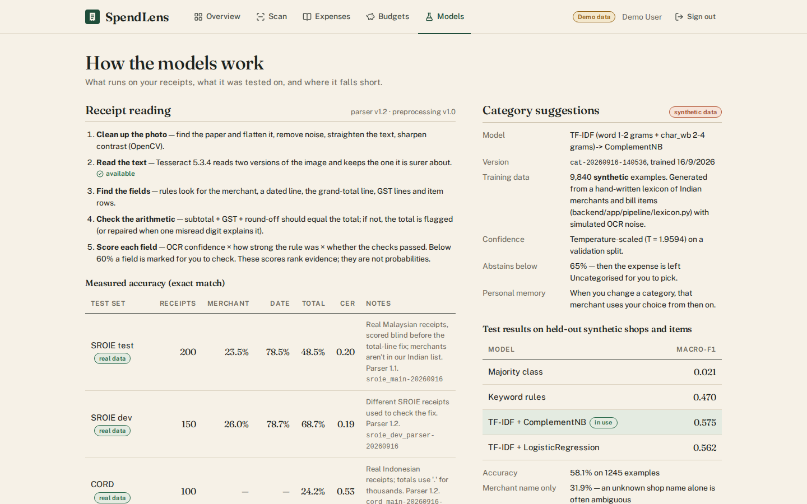
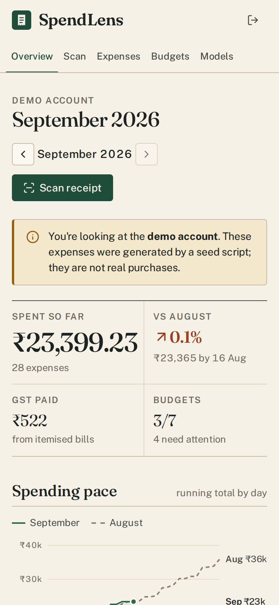
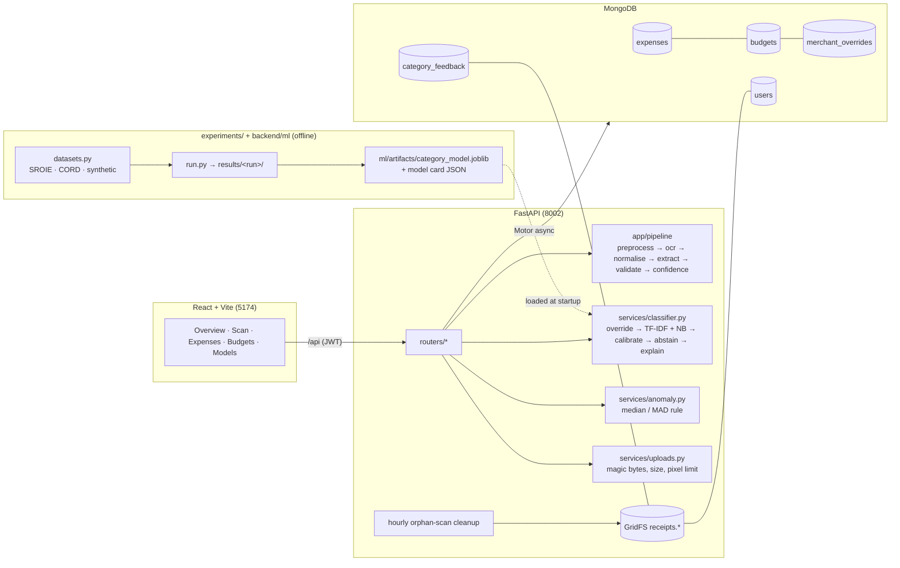

# SpendLens

Scan a paper bill, check what was read, and track where your money goes. An India-first receipt
understanding and expense tracking app: OpenCV + Tesseract OCR, rule-based field extraction with
validation, a calibrated text classifier that abstains when unsure, and per-user anomaly flags.
React + FastAPI + MongoDB.

## Demo


| Overview (demo account, seeded data) | Models page | Phone (375 px) |
|---|---|---|
|  |  |  |

All screenshots were taken by the Playwright end-to-end test against the running app. The overview
and expenses screens show the **demo account**. Its data is generated by `scripts/seed.py` and
labelled "Demo data" in the UI.

## Problem

Paper bills are still common in India (supermarkets, pharmacies, restaurants, fuel pumps). Typing
them into an expense tracker is tedious, so people stop doing it. A useful scanner has to:

- pull out the merchant, date, total and GST from a skewed, faded thermal print;
- say *which* fields it is unsure about, instead of silently getting them wrong;
- file the expense under a sensible category without pretending to be sure when it isn't;
- turn the ledger into something actionable: budgets, pace and unusual spends.

## Solution

1. **Receipt pipeline:** clean up the photo (OpenCV), read it with Tesseract, extract fields with
   rules, and check the receipt's own arithmetic. Every field comes with a confidence score and the
   evidence line it came from. The UI marks uncertain fields and lists the checks that failed.
2. **Category model:** TF-IDF features into a linear classifier (ComplementNB was selected over
   LogReg on validation). Probabilities are temperature-scaled. Below a threshold chosen on
   validation, the app says "Uncategorised" instead of guessing, and it shows the words behind each
   suggestion. User corrections become per-merchant overrides straight away and training data for an
   admin-triggered retrain.
3. **Insights:** Mongo aggregations for totals, pace and categories; budgets with a straight-line
   month-end projection; robust z-score (median/MAD) anomaly flags with a plain-language reason.
4. **Honest evaluation:** real public receipts (SROIE, CORD) as well as synthetic Indian bills, with
   ablations, baselines, calibration, error analysis and recorded run environments.

## Architecture



## AI/ML Pipeline

| stage | code | what happens |
|---|---|---|
| input | `routers/receipts.py`, `services/uploads.py` | JPG/PNG/WebP up to 8 MB. Type decided by magic bytes; images over 40 MP refused. |
| 1. preprocess | `app/pipeline/preprocess.py` | EXIF rotation → resize (long side ≤ 2000 px, short side ≥ 900 px) → find the paper (largest convex 4-point contour) and warp it flat → grayscale → non-local-means denoise → deskew (text lines smeared into blobs, `minAreaRect` long-edge angle, Hough fallback) → adaptive Gaussian threshold |
| 2. OCR | `app/pipeline/ocr.py` | Tesseract 5 (LSTM, PSM 6) on the thresholded **and** the denoised grayscale image in parallel; keeps the read with the higher mean word confidence. Words, boxes and confidences are kept for the preview. |
| 3. normalise | `app/pipeline/normalise.py` | amounts (`1,23,456.00`, `473,00`, `Rs .497.00`, `1,2O4.00`), day-first dates in about ten formats (future/impossible rejected), merchant keys |
| 4. extract | `app/pipeline/extract.py` | merchant (fuzzy match against 328 Indian merchants, else the first name-like header line), date (labelled line wins), total (ranked keywords; subtotal/tax/qty lines excluded; tax-inclusive total lines allowed; largest-amount fallback), GST (CGST+SGST+IGST+cess), payment mode, line items |
| 5. validate | `app/pipeline/validate.py` | subtotal + tax + round-off = total (or rate × litres); digit-swap repair when one confusable digit explains the gap; missing total/date; items vs subtotal. Returned as `checks` with a message. |
| 6. confidence | `app/pipeline/confidence.py` | documented formula (see Technical Deep Dive); fields below 0.6 are flagged |
| 7. category | `services/classifier.py` | per-user override → TF-IDF (word 1–2 + char 2–4 grams) → ComplementNB → temperature T → abstain below τ → top contributing tokens |
| 8. record | `routers/expenses.py` | expense saved with suggested vs chosen category (a difference is logged as a correction); receipt marked attached |
| insights | `services/anomaly.py`, `routers/insights.py` | per-category robust z-score; `$facet` aggregations |

## Features

- **Scan:** drag-drop, file picker or phone camera. The review screen shows the photo or "what OCR
  read" (the cleaned image with a box per word, low-confidence words in orange), editable fields
  flagged by confidence, validation messages, and editable line items. Discarding a scan deletes the
  photo; unsaved scans are removed after 24 h.
- **Category suggestion:** confidence, the words that drove it, alternatives as one-click chips, an
  explicit "Not sure → Uncategorised" state, and "using your earlier choice" for merchants you corrected.
- **Ledger:** add/edit/delete (with a confirm dialog), search by merchant/item/note, filter by month
  and category (including "Needs a category"), pagination, receipt viewer, CSV export (UTF-8 BOM for Excel).
- **Budgets:** monthly limit per category, progress bar, projection, and on track / on pace to
  exceed / over status.
- **Overview:** month total compared with the same days of last month, running-total pace chart,
  category split with change, top merchants, budget status, "Worth a look" anomalies with the reason.
- **Models page:** model card (version, date, data, **synthetic** label, calibration, threshold,
  baselines, limitations), receipt-pipeline stages, and the real and synthetic evaluation numbers
  read from the result files.
- **Demo account** clearly labelled as demo data.

## Tech Stack

| layer | tools |
|---|---|
| Frontend | React 19, TypeScript, Vite, react-router, plain CSS, Fraunces + Public Sans (self-hosted), lucide icons, hand-drawn SVG chart; vitest + Testing Library |
| Backend | FastAPI, Pydantic v2, Motor (async MongoDB), GridFS, bcrypt, PyJWT |
| ML / vision | OpenCV, Tesseract 5 via pytesseract, scikit-learn, NumPy, Pillow |
| Evaluation | pyarrow (dataset parquet), rapidfuzz (CER / fuzzy match), PyYAML configs |
| Testing | pytest, Playwright (Python, headless Chromium), GitHub Actions |

## Project Structure

```
backend/
  app/
    pipeline/        preprocess, ocr, normalise, extract, validate, confidence, receipt, lexicon
    services/        classifier (serving), anomaly, uploads, images
    routers/         receipts, expenses, budgets, insights, categories (+ /api/model)
    main.py config.py db.py security.py auth.py schemas.py categories.py utils.py
  ml/
    dataset.py            synthetic merchant/item text + strict splits
    pipeline.py           TF-IDF feature union, LogReg / ComplementNB factories
    baselines.py          majority (DummyClassifier), hand-written keyword rules
    calibration.py        temperature scaling, ECE / reliability, Brier, threshold selection
    evaluate_classifier.py  experiment + production artifact + model card
    train_classifier.py   `python -m ml.train_classifier`
    retrain.py            fold user corrections into the model
    receipts_synth.py     synthetic Indian receipt photos with ground truth
    artifacts/            category_model.joblib (2.6 MB) + category_model.card.json
  scripts/seed.py    demo account (labelled demo)
  tests/             pytest: API, parser, OCR pipeline, ML, robustness, eval metrics
frontend/src/        pages/, components/ (+ *.test.tsx), lib/
experiments/         datasets.py, receipts_eval.py, run.py, analyse_errors.py, summarise.py,
                     configs/, results/<run>/, reports/
data/                README.md (sources, licences), manifest.json (hashes); raw/ and cache/ are git-ignored
e2e/                 test_e2e.py, run_e2e.sh
docs/                AUDIT.md, screenshots/
samples/             3 synthetic receipts to try (with ground-truth JSON)
```

## Installation

### Windows (primary)

Prerequisites: **Python 3.11**, **Node 20+** (22 recommended), **MongoDB Community 7 or 8** running
on `localhost:27017`.

**1. Tesseract OCR** (not pip-installable)

1. Download the UB Mannheim installer from <https://github.com/UB-Mannheim/tesseract/wiki>
   (`tesseract-ocr-w64-setup-5.x.x.exe`) and install it to the default
   `C:\Program Files\Tesseract-OCR`. English is included.
2. Either add that folder to *Path* (Start → "Edit the system environment variables" → Environment
   Variables → Path → New) and open a new terminal (`tesseract --version` should work), **or** set
   `TESSERACT_CMD=C:\Program Files\Tesseract-OCR\tesseract.exe` in `backend\.env`.
3. `GET http://127.0.0.1:8002/api/health` shows `"ocr": {"available": true}`. Without Tesseract
   the app still runs: the Scan page says text reading is off, keeps the photo, and you type the details.

**2. Backend**

```powershell
cd spendlens\backend
python -m venv .venv
.venv\Scripts\activate
pip install -r requirements-dev.txt
copy .env.example .env
python -c "import secrets; print(secrets.token_urlsafe(48))"   # paste into JWT_SECRET in .env
python -m scripts.seed                                          # demo@spendlens.app / demo1234
```

**3. Frontend**

```powershell
cd spendlens\frontend
npm install
```

### macOS / Linux

Same steps. Install Tesseract with `brew install tesseract` or `sudo apt install tesseract-ocr`,
activate the venv with `source .venv/bin/activate`, and use `cp` instead of `copy`.

The saved classifier is tied to the scikit-learn version that wrote it. If yours differs, the API
reports the model as `rebuilding`, retrains it in the background (a few seconds) and then serves it.

## Environment Variables

`backend/.env` (see `.env.example`):

| name | required | default | purpose |
|---|---|---|---|
| `ENV` | no | `development` | `production` refuses to start with a placeholder or short `JWT_SECRET` |
| `JWT_SECRET` | yes in production | placeholder | token signing key, 32+ chars. In development a placeholder is replaced by a random per-process secret, with a warning. |
| `JWT_EXPIRE_MINUTES` | no | `10080` | session length |
| `MONGO_URI` | no | `mongodb://127.0.0.1:27017` | database |
| `MONGO_DB` | no | `spendlens` | database name |
| `CORS_ORIGINS` | no | `http://localhost:5174,http://127.0.0.1:5174` | allowed browser origins |
| `TESSERACT_CMD` | Windows, if not on PATH | empty | full path to `tesseract.exe` |
| `MAX_UPLOAD_MB` | no | `8` | upload size limit |
| `ORPHAN_RECEIPT_HOURS` | no | `24` | unsaved scans older than this are deleted (checked hourly) |
| `LOGIN_MAX_ATTEMPTS` / `LOGIN_WINDOW_SECONDS` | no | `10` / `300` | failed sign-ins allowed per email + IP per window |
| `ADMIN_EMAILS` | no | empty | who may call `POST /api/categories/retrain` |
| `AUTO_REBUILD_MODEL` | no | `true` | retrain the category model in the background if the file can't be loaded |
| `MODEL_PATH` | no | `ml/artifacts/category_model.joblib` | classifier artifact (its card sits next to it) |

Frontend: `VITE_BACKEND` (default `http://127.0.0.1:8002`) sets the dev-server proxy target.

## Running Locally

```powershell
# terminal 1
cd backend; .venv\Scripts\activate
uvicorn app.main:app --reload --port 8002        # API docs: http://127.0.0.1:8002/docs
# terminal 2
cd frontend
npm run dev                                       # http://localhost:5174
```

On the sign-in page, "Use demo account" fills in the demo credentials. `samples/` has three
synthetic receipts to upload.

## Training

```powershell
cd backend
python -m ml.train_classifier       # = python -m experiments.run --config experiments/configs/category_main.yaml
```

This generates the synthetic splits, fits the four models, selects one on validation macro-F1, fits
the temperature and abstention threshold on validation, evaluates on test once, refits on all
synthetic merchants, and writes `ml/artifacts/category_model.joblib` plus `category_model.card.json`
(version, date, data hash and size, **synthetic: true**, hyper-parameters, seed, library versions,
metric summary). The whole run took 5.0 s on the 2-CPU build machine (`seconds` in its `metrics.json`).

User corrections: an admin (`ADMIN_EMAILS`) calls `POST /api/categories/retrain`, or runs
`python -m ml.retrain`. The model card then records how many corrections were added and notes that
the retrained model hasn't been re-evaluated.

## Evaluation

```powershell
# from the project root
python -m experiments.datasets download sroie
python -m experiments.datasets download sroie_train
python -m experiments.datasets download cord
python -m experiments.run --config experiments/configs/sroie_main.yaml
python -m experiments.summarise
```

**Metrics and why these:**
- Receipt fields use exact match. A total that is off by a paisa is wrong. There is also a
  normalised match (separators ignored) and fuzzy merchant match to see *how* things fail.
- OCR quality is character error rate (CER) and word recall against the datasets' text labels.
- For field confidence, the question is whether it is useful, so each run reports the accuracy of
  totals the UI would flag vs not flag.
- The classifier reports accuracy and macro-F1 (every category matters to a user), log-loss and
  Brier (probability quality), ECE with a reliability table (the probability is shown to users),
  and a risk-coverage table for the abstention threshold.
- Thresholds and model selection use validation only.

## Experiments

See [`experiments/README.md`](experiments/README.md) for the run list and how to add one. Every run
folder stores the config, git commit, library and Tesseract versions, dataset hash and subset hash,
metrics and error files. [`experiments/reports/summary.md`](experiments/reports/summary.md) is
generated from them. [`receipts.md`](experiments/reports/receipts.md) and
[`classifier.md`](experiments/reports/classifier.md) are the written analyses.

## Results

All numbers below were measured on 2026-09-16 with Tesseract 5.3.4 on a shared 2-CPU machine, and
are stored under `experiments/results/`. Real and synthetic results are kept apart on purpose.

### Receipt extraction on real receipts (exact match)

| test set | parser | receipts | merchant | date | total | OCR CER | s / receipt |
|---|---|---|---|---|---|---|---|
| SROIE test subset (Malaysia), scored blind — `sroie_main` | 1.1 | 200 | 23.5% | 78.5% | 48.5% | 0.197 | 1.8 |
| SROIE train split as a dev set — `sroie_dev_parser` | 1.1 | 150 | 26.0% | 78.7% | 56.0% | 0.189 | 1.9 |
| same, after the total-line fix | **1.2** | 150 | 26.0% | 78.7% | **68.7%** | 0.189 | 1.9 |
| SROIE test subset re-scored with 1.2 (**post-hoc**, the fix came from its errors) | 1.2 | 200 | 23.5% | 78.5% | 57.5% | 0.197 | — |
| CORD test (Indonesia; no merchant/date labels) — `cord_main-r2` | 1.2 | 100 (95 with total) | — | — | 24.2% | 0.534 | 1.1 |

These are receipts from other countries. SROIE merchants are Malaysian companies whose headers
often start with a person's name, and CORD writes `40.000` for forty thousand. Low merchant and CORD
total scores are expected; see Error Analysis. No labelled Indian receipt dataset was available.
Dataset required before evaluation.

**Does the field confidence help?** On `sroie_main`, 38.5% of totals were flagged for review.
Unflagged totals were right 64.2% of the time, flagged ones 23.4%. With parser 1.2 on the dev
split: 17.3% flagged, 79.8% vs 15.4%.

**OCR ablation (SROIE, same 60 receipts, parser 1.1)**

| setting | merchant | date | total | CER |
|---|---|---|---|---|
| preprocessing + read both images, PSM 6 (production) | 46.7% | 80.0% | 48.3% | **0.173** |
| raw grayscale, PSM 6 | 41.7% | 75.0% | 53.3% | 0.208 |
| preprocessing, thresholded image only | 36.7% | 75.0% | 48.3% | 0.199 |
| preprocessing + both, PSM 4 | 41.7% | 75.0% | 53.3% | 0.210 |
| preprocessing + both, PSM 11 | 43.3% | 81.7% | 48.3% | 0.314 |

On CORD's photographed receipts, preprocessing matters more: CER 0.534 vs 0.926 raw, total 24.2%
vs 19.1% (50 receipts). On SROIE's flat scans it lowers CER but doesn't improve totals, and a
5-point difference on 60 receipts is 3 receipts.

### Receipt extraction on synthetic Indian bills (**synthetic**)

| set | receipts | merchant | date | total |
|---|---|---|---|---|
| development seed (the parser was built looking at these) — `synthetic_dev-r2` | 30 | 100% | 100% | 100% |
| held-out seed — `synthetic_test-r2` | 60 | 100% | 100% | 96.7% |

These mainly show that the parser and the generator agree. They are not evidence of real-world accuracy.

### Category classifier (**synthetic** data, merchants and item words held out)

| model | test accuracy | test macro-F1 | log-loss | ECE |
|---|---|---|---|---|
| majority class | 12.0% | 0.021 | 24.30 | 0.879 |
| keyword rules | 45.9% | 0.470 | 13.57 | 0.526 |
| TF-IDF + LogReg | 57.3% | 0.562 | 1.366 | 0.107 |
| **TF-IDF + ComplementNB** (selected on validation) | **58.1%** | **0.575** | 1.365 | 0.101 |

- Test set: 1,245 examples. Unseen merchant name only: 31.9%.
- Temperature scaling (T = 1.96): ECE 0.101 → 0.091, log-loss 1.365 → 1.333.
- Abstention threshold 0.65 (validation target 80%): the model suggests for **34.3%** of test
  examples and is right **89.9%** of the time; the rest become "Uncategorised".
- With item words shared across splits (the phase-1 setup), LogReg scored 0.848 macro-F1, so that
  earlier number mostly reflected memorised item words.

## Error Analysis

From `experiments/results/sroie_main-20260916/errors.md` and `errors_breakdown.json` (276 field
errors on 200 SROIE receipts), plus the classifier's `errors.md`. The full write-up is in
`experiments/reports/`.

- **Totals:**
  - 45 of 103 errors fell back to the largest amount. Reading them showed 32 had a line like
    `TOTAL (GST INCL) 22.45` that the "skip GST lines" rule threw away. That rule was wrong for
    Indian bills too, so parser 1.2 accepts tax-inclusive total lines. Checked on different receipts
    (the SROIE train split): 56.0% → 68.7%.
  - 34 errors picked a different total-like line (`Total 0% supplies`, `GST payable (6%)`).
  - 16 were one- or two-digit OCR misreads on the right line.
  - 44 wrong totals still had confidence ≥ 0.6. The arithmetic check sometimes "confirms" a wrong
    total when the subtotal was also misread (e.g. `X51006311714`).
- **Merchant:** 92 of 130 errors took the wrong header line (a person's name, "COPY", "POSTED", logo
  noise). The first-name-like-line rule is an Indian-bill assumption. Another 22 names carried a
  registration number (`GARDENIA BAKERIES (KL) SDN BHD (139386 X)`) and failed the letters-only test.
  Only 2 were false matches against the Indian lexicon.
- **Date:**
  - 24 had no parseable date (OCR broke the digits).
  - 14 were off by one digit (`2015` for `2018`). A few printed dates disagree with the label, which
    looks like label noise.
  - 5 picked another date (card expiry).
- **CORD:** 44 of 72 errors found no total at all, and 8 had the right digits in the wrong format
  (`40.000`, `40 ,000`). This is mainly a locale gap.
- **Classifier:** most confident mistakes come from name collisions inside the hand-written lexicon:
  - "Sapna Book House" (Education) vs "Sapna Book House Stationery" (Shopping);
  - "Amazon Prime" vs "Amazon"; "Swiggy" vs "Swiggy Instamart";
  - "Delhi Jal Board" pulled toward "Delhi Metro".
  - Entertainment is most often confused with Bills (35) and Groceries (34), because held-out words
    like "monthly plan" read like recharge plans.

## API Documentation

Interactive docs: `http://127.0.0.1:8002/docs`. Errors always look like
`{"detail": str | [{loc, msg}], "status": int}`. Everything except auth, health, categories and model
needs `Authorization: Bearer <jwt>`.

| method | path | purpose |
|---|---|---|
| POST | `/api/auth/register`, `/api/auth/login` | returns `{token, user}` (`user.is_demo`). Login is rate-limited (429 + `Retry-After`). |
| GET | `/api/auth/me` | current user |
| GET | `/api/health` | `status: ok | degraded`, `degraded: [...]`, db, `ocr`, `classifier`, `model: {status, version, error}` |
| GET | `/api/model` | category model card and status, receipt pipeline versions, anomaly rule, latest evaluation summaries |
| POST | `/api/receipts/scan` | multipart `file` → `receipt_id`, `fields{value, confidence, source, line}`, `items`, `checks`, `category` suggestion, `review_threshold`, `ocr` (lines, preview image + word boxes). 415 type, 413 size, 422 unreadable or too many pixels, 503 OCR timeout |
| GET | `/api/receipts/{id}/image` | stored JPEG (owner only) |
| DELETE | `/api/receipts/{id}` | discard an unsaved scan (409 if attached to an expense) |
| GET | `/api/expenses?month=&category=&q=&page=&limit=` | page + total + sum; rows carry `anomaly {reason, detail, z, ratio}` and `demo` |
| POST | `/api/expenses` | create. Without `category`, the suggestion is used, or `Uncategorised` if the model abstains. `suggested_category` ≠ `category` records a correction |
| GET / PATCH / DELETE | `/api/expenses/{id}` | read / partial update (category change is learned) / delete (and its photo) |
| GET | `/api/expenses/export?month=` | CSV |
| GET / PUT / DELETE | `/api/budgets`, `/api/budgets/{category}` | status with projection; upsert; remove |
| GET | `/api/insights/overview?month=` | totals, same-period comparison, split, pace series, top merchants, anomalies, budgets |
| GET | `/api/categories` | categories (incl. `Uncategorised`), model classes, payment modes |
| POST | `/api/categories/suggest` | `{merchant, items}` → `{category, confidence, status, abstained, threshold, explanation, alternatives, source, model_version}` |
| GET | `/api/categories/overrides` | your learned merchant → category map |
| POST | `/api/categories/retrain` | admin only (403 otherwise) |

## Screenshots

| | |
|---|---|
| Scan review |  |
| Expenses (demo data) |  |
| Models |  |
| Overview (demo data) |  |
| Phone, 375 px |  |

## Technical Deep Dive

**Why rules + OCR rather than an end-to-end document model.** A layout model (Donut, LayoutLMv3)
needs a GPU or a slow CPU pass and labelled Indian receipts, which I don't have. Receipt layouts
follow strong conventions, and rules can be read, unit-tested and debugged line by line; the error
analysis above found a real bug in an afternoon. The cost is brittleness outside those conventions,
which the SROIE merchant numbers show.

**Why this preprocessing.**
- Phone photos have background, perspective, tilt, uneven light and sensor noise. Each step targets
  one of those.
- Adaptive thresholding handles shadows but erases faint thermal print, so both versions are read
  and Tesseract's own mean confidence picks one.
- An early median blur after thresholding filled in slashed zeros (`0` read as `6`). The synthetic
  evaluation caught it, and the blur was removed.
- The ablation shows the steps help photos (CORD) much more than flat scans (SROIE).

**Baselines.**
- For extraction: raw Tesseract without preprocessing, and other page-segmentation modes.
- For categories: majority class and hand-written keyword rules. The learned models beat the rules by
  about 0.1 macro-F1 and give usable probabilities; the rules don't.

**Features.** Word 1–2-gram TF-IDF captures "petrol pump", "movie ticket". Character 2–4-gram
TF-IDF (word-boundary aware) copes with OCR typos and unseen brand names that share pieces with
known ones ("…medicals", "…mart"). Both use sublinear TF.

**Inference.**
- The classifier and the Tesseract probe load once at startup.
- OCR runs in the thread pool, two Tesseract processes in parallel, each with a 30 s timeout.
- OCR took 1.1–1.9 s per receipt in the evaluation runs (shared 2-CPU machine).
- If the model file is missing or incompatible, the API stays up: `/api/health` says `degraded`,
  suggestions return `status: unavailable`, expenses are saved as Uncategorised, and a background
  rebuild runs.

**Field confidence** (`app/pipeline/confidence.py`). `q` is Tesseract's mean word confidence for
the source line.

| field | how it's scored |
|---|---|
| merchant | `similarity × (0.6 + 0.4q)` for a lexicon match, else `0.55q` |
| date | `(0.95 if the line says Date/Dt else 0.75) × (0.5 + 0.5q)` |
| total | `keyword strength (1.0 "grand total" … 0.6 "amount") × (0.55 + 0.4q) × (0.9 + 0.1·position)`, or `0.35` for the largest-amount fallback |

Validation then adjusts the total:
- arithmetic agrees → at least 0.95;
- repaired by a digit swap → 0.70;
- disagrees → at most 0.60.

Fields below 0.6 are flagged. These are hand-set **scores**, not probabilities; the evaluation checks
whether they separate right from wrong (64% vs 23% on SROIE), not whether 0.7 means 70%.

**Category confidence.** Temperature scaling fits one number on validation, so accuracy doesn't
change. The abstention threshold is the lowest confidence at which validation accuracy reaches 80%.
Explanations are exact for linear models: the contribution of a feature is `tfidf × weight`
(relative to the class average for NB). The UI shows the top word features, or character pieces
when no word contributes.

**Anomalies.** Modified z-score `0.6745·(x − median)/MAD` per category over the user's last 180
days, flagged when z > 3.5 **and** x ≥ 2× the median, with at least 6 past expenses. Median/MAD
because a single large purchase inflates a standard deviation and hides itself. There's no
IsolationForest: new users have a handful of rows per category, and a rule produces a sentence the
user can check. Boundary cases are unit-tested.

**Failure modes.**
- Headers that don't start with the shop name.
- Totals printed on a line the rules exclude.
- Non-Indian amount formats.
- The arithmetic check agreeing with a misread subtotal.
- Handwritten or very faded bills.
- Ambiguous merchant names (the model abstains; the user decides once and the override remembers).

**Metrics that matter for users.** "How often is a total I didn't check wrong?" (accuracy of
unflagged fields) and "How often is a shown category wrong?" (accuracy at the threshold), more
than overall accuracy.

**Data needed next.** 100–300 labelled Indian receipts (merchant, date, total, GST) to measure the
real target domain, and real merchant strings (UPI payee names) with categories for the classifier.

**Scaling.**
- OCR is the cost: about 2 s of CPU per scan. A real deployment would move scans to a worker queue
  (Celery/RQ), store images in object storage instead of GridFS, and keep the rate limiter and
  cleanup state in Redis.
- MongoDB queries already use `user_id`-first indexes and single-round-trip `$facet` aggregations.

**What changes for production.**
- Secrets and CORS set per environment (the app already refuses a placeholder secret when `ENV=production`).
- HTTPS, and a malware scan on uploads.
- Retraining as a reviewed offline job with evaluation before swapping models, not an endpoint.
- Monitoring of the flag rate and abstention rate as drift signals.
- Money stored as integer paise.

## Deployment

Live demo: not deployed yet.
Repository: not published yet.

Production setup: React build on **Vercel** (`frontend/vercel.json` rewrites `/api/*` to the API),
FastAPI in **Docker on Render** (`render.yaml`, `backend/Dockerfile`), data in **MongoDB Atlas**.
Step-by-step instructions, environment variables and measured memory use are in
[docs/DEPLOYMENT.md](docs/DEPLOYMENT.md).

## Limitations

- No labelled Indian receipts: Indian-specific accuracy is only measured on synthetic bills.
- The category model is trained and evaluated only on synthetic text generated from a hand-written
  lexicon, which has some merchant-name overlaps of its own.
- Field confidences are ranked scores, not calibrated probabilities.
- English text only. Hindi and regional scripts need extra Tesseract language data and different rules.
- The login rate limiter and cleanup loop are per process.
- The parser 1.2 fix was found by looking at SROIE test errors. The fair check is on the SROIE
  train split, and the re-scored test number is marked post-hoc.

## Future Work

- A learned header-line classifier for merchants and payment-line agreement for totals (see the
  error analysis).
- A stricter arithmetic check that requires high OCR confidence on both sides.
- Collect and label a small Indian receipt set; evaluate before any further rule changes.
- Locale-aware amount parsing.
- Calibrate field confidences (isotonic regression on a labelled dev set) once real labels exist.
- Background OCR worker, object storage, recurring expenses, UPI SMS import.

## Testing

Last full run (2026-09-16), all passing:

| suite | command | tests |
|---|---|---|
| backend (pytest, real MongoDB, throwaway `test_*` database) | `cd backend && python -m pytest -q` | 82 |
| frontend unit (vitest + Testing Library, jsdom) | `cd frontend && npm test` | 16 |
| end-to-end (Playwright, headless Chromium) | `./e2e/run_e2e.sh` | 3 |

- **Backend** covers the API, parser rules and validation checks, deskew, contour detection, OCR
  accuracy on generated receipts, calibration helpers, baselines and the split, anomaly rule
  boundaries, and robustness:
  - empty, wrong-type, oversized and decompression-bomb uploads;
  - a blank image;
  - missing or corrupt model files and the degraded health state;
  - the abstention path, login rate limit, JWT secret guard;
  - orphan cleanup and admin-only retraining.
- **Frontend** covers abstention and explanation rendering, form validation, confidence flags,
  validation-check ordering, the OCR overlay, API error handling and ₹ formatting.
- **End-to-end:** register → scan a generated receipt (fields, checks, OCR view) → correct the
  category → save → add a manual expense → an ambiguous merchant is saved as Uncategorised → delete
  with confirmation → filter and search → view the receipt → CSV export → budgets → overview → the
  correction is remembered → demo account, Models page and screenshots.
  - `run_e2e.sh` needs bash (Git Bash on Windows). Otherwise start both servers yourself and run
    `set BASE_URL=http://127.0.0.1:5174` then `python -m pytest e2e/test_e2e.py`. A new machine
    needs `playwright install chromium` once.

CI (`.github/workflows/ci.yml`) runs the backend tests with a MongoDB service container and
Tesseract from apt, and the frontend unit tests and build.

On Windows, run the e2e script from **Git Bash** with the backend virtual environment active, and point it at that interpreter: `PYTHON=python bash e2e/run_e2e.sh`. Install the browser once with `python -m playwright install chromium`.

## License

MIT. See [LICENSE](LICENSE). Evaluation datasets keep their own licences (see `data/README.md`) and
are not redistributed.
